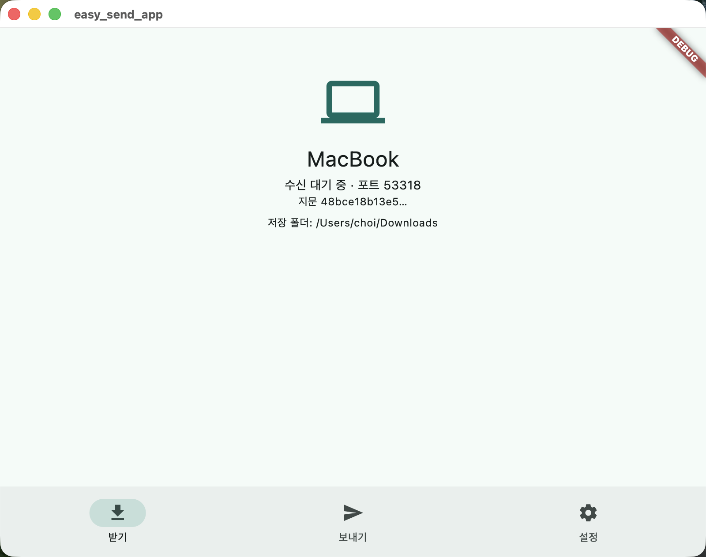
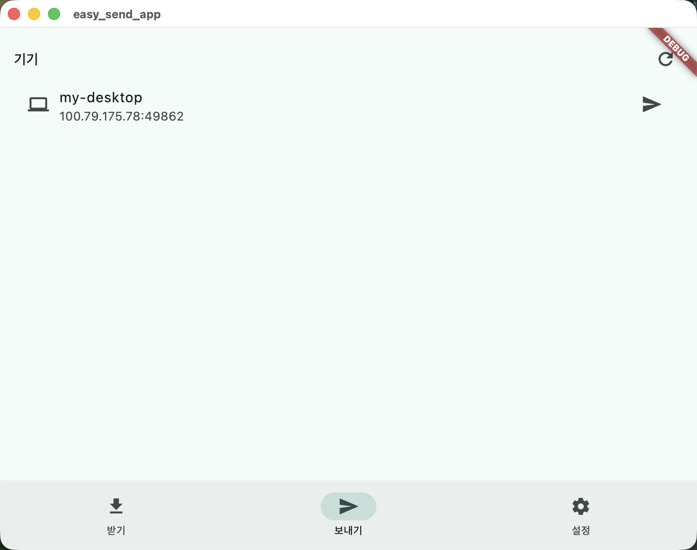
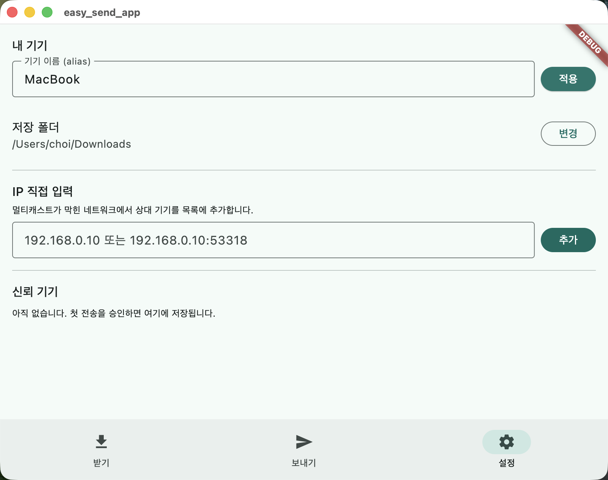

# easy-send

같은 Wi-Fi(LAN) 안의 기기끼리 **서버 없이** 파일을 직접 주고받는 앱(LocalSend 클론). 프로토콜을 직접 설계·구현하며 학습하는 것이 목적인 개인 프로젝트로, UI는 Flutter, 프로토콜 코어는 Rust로 되어 있다. macOS·Android에서 실기기 검증을 마쳤다.

"서버 없음"은 서버가 없다는 뜻이 아니라 **서버가 각 기기 안에 내장**되어 외부 인프라·인터넷 없이 LAN 직통으로 전송된다는 뜻이다. 모든 기기가 송신·수신 양쪽 다 가능한 대칭 구조다.

## 화면 (3탭)

**받기 (홈)** — 내 기기 이름·지문과 수신 대기 상태를 보여준다. 다른 기기가 전송을 요청하면 승인 다이얼로그(파일 목록·크기·새 기기 뱃지)가 뜬다.

<p>
  
</p>

**보내기** — 같은 네트워크에서 발견된 기기 목록. 기기를 고르고 파일을 선택하면 전송 진행률이 표시된다.

<p>
  
</p>

**설정** — 기기 이름(alias)·저장 폴더 변경, 멀티캐스트가 막힌 네트워크를 위한 IP 직접 입력, 신뢰 기기 목록 관리.

<p>
  
</p>

## 동작 방식

| 단계 | 방식 |
|---|---|
| 탐색 | UDP 멀티캐스트(`224.0.0.168:53318`) + 서브넷 브로드캐스트 병행 announce, 5초 주기, 15초 TTL. 폴백 = IP 직접 입력 |
| 전송 | HTTPS(자체서명 인증서). `prepare-upload`(파일 메타) → 수신자 승인 → 파일별 raw 업로드. 동시 세션 1개 |
| 보안 | 인증서 지문(SHA-256) = 기기 ID. TOFU(최초 연결 시 사용자 확인, 이후 지문 비교), PIN 없음 |

왜 이렇게 설계했는지는 **[docs/adr/](docs/adr/)** 에 결정별로 기록되어 있다 — 검토한 대안과 기각 이유 포함.

## 구조

```
app/         Flutter 앱 (UI·Riverpod). 프로토콜은 아래 Rust 코어를 FRB로 호출
app/rust/    Rust 프로토콜 코어(탐색·전송·보안) + 검증용 CLI 바이너리 easy-send-rs
go-cli/      Go 독립 피어 (ls·send·recv) — 프로토콜 스펙만 보고 구현한 검증 하니스
docs/adr/    아키텍처 결정 기록 (ADR)
```

프로토콜 스펙 하나로 Rust·Go(그리고 초기의 Dart) 3개 구현이 상호 전송됨을 체크섬 일치로 검증했다. 초기 순수 Dart 코어는 Rust로 교체된 뒤 `archive/dart-core` 브랜치에 참조용으로 보존되어 있다.

## 빌드·실행

사전 조건: Flutter SDK, Rust 툴체인(rustup). macOS 빌드는 Xcode, Android 빌드는 NDK + `cargo-ndk`가 추가로 필요하다.

```bash
# macOS 앱
cd app
export DEVELOPER_DIR=/Applications/Xcode.app/Contents/Developer
flutter run -d macos

# Android APK
cd app
flutter build apk --debug
adb install build/app/outputs/flutter-apk/app-debug.apk

# Go CLI 피어
cd go-cli
go build -o easy-send .
./easy-send ls                      # 주변 기기 탐색
./easy-send recv --dir ~/Downloads  # 수신 대기
./easy-send send 파일 --to <alias|IP>
```

- 빌드 스크립트(Cargokit)가 `rustc`를 직접 찾으므로 Rust 툴체인이 셸 PATH에 있어야 한다. rustup을 Homebrew로 설치했다면 `~/.rustup/toolchains/<채널>/bin`이 PATH에 없을 수 있다.
- Rust 의존성의 TLS 백엔드는 ring으로 고정되어 있다 — 기본값(aws-lc-rs)은 Android 크로스컴파일이 깨진다. 의존성을 올릴 때 이 정렬을 유지해야 한다.

## 알아두기

- **기기가 목록에 안 보이면**: 소비자 공유기 상당수가 멀티캐스트를 무선 구간에서 버린다. 이 앱은 브로드캐스트를 병행해 대부분 커버하지만, 그래도 안 보이면 설정 탭에서 상대 IP를 직접 입력한다.
- **AP isolation**(공유기가 무선 기기 간 통신을 차단하는 설정, 공용 Wi-Fi에 흔함) 환경에서는 IP 직접 입력도 통하지 않는다 — 네트워크 자체가 기기 간 패킷을 막기 때문.
- 수신은 **앱이 실행 중일 때만** 된다(백그라운드 상주 없음).
- 저장 폴더에 같은 이름의 파일이 있으면 `이름 (1).확장자` 식으로 번호를 붙인다(덮어쓰기 없음).
- 앱을 재설치하면 인증서가 재생성되어 상대 기기에서 "새 기기"로 보인다 — 기기 ID가 인증서 지문이기 때문([ADR-004](docs/adr/004-신뢰모델-TOFU-지문이-기기ID.md)).
