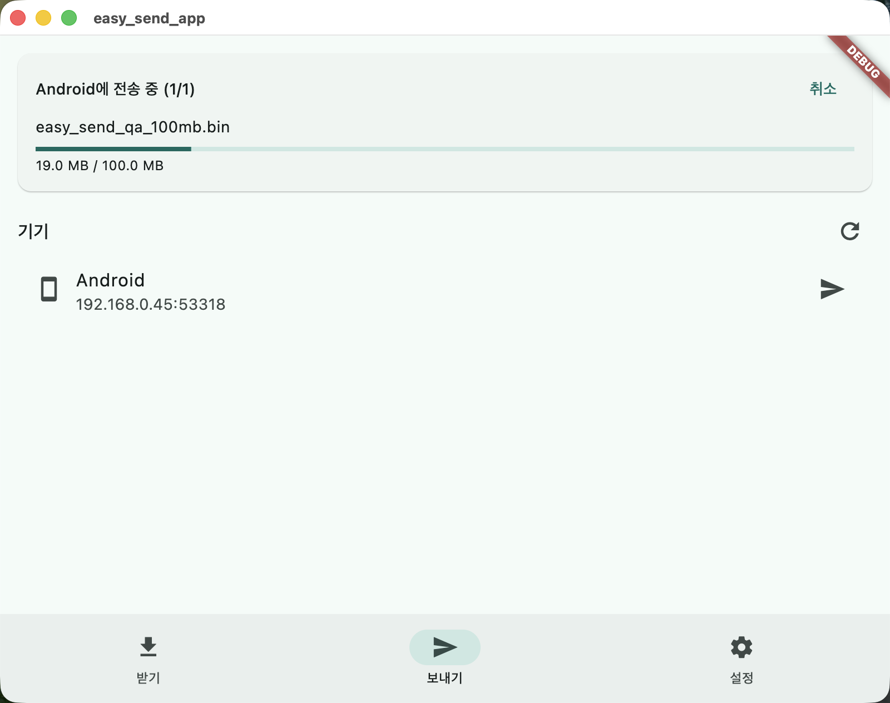
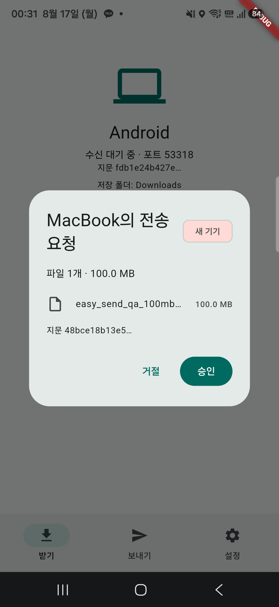
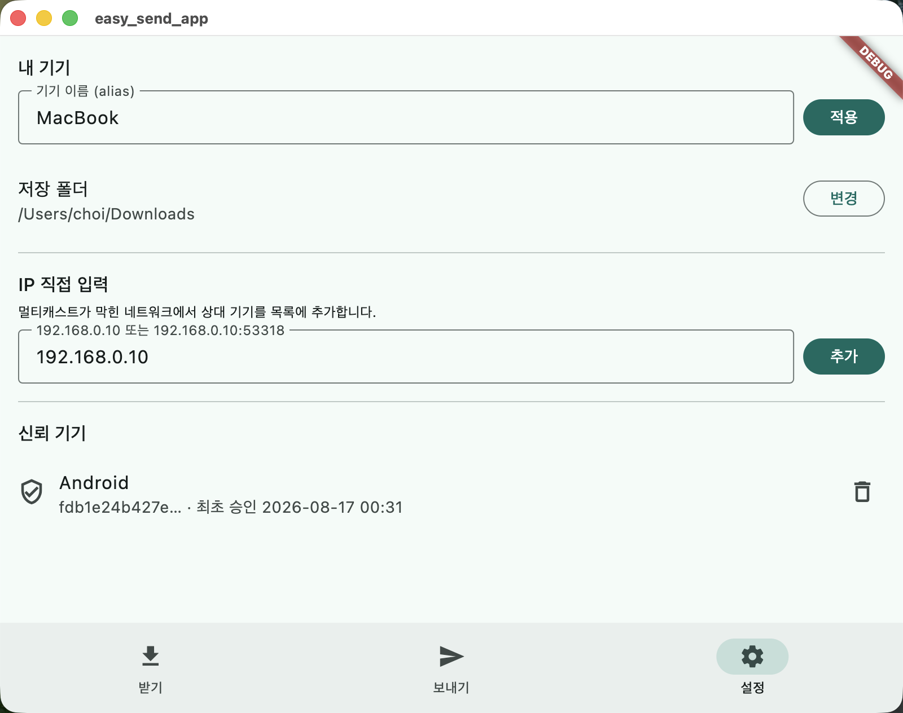

# mac 앱 UI QA (2026-08-17)

> 결론: **전부 PASS.** mac 앱과 Android 실기기(Galaxy A54) 간 실제 전송으로 mac UI의 마지막 미검증 3항목을 확인했다. 이것으로 계획된 검증(M0~M4·Phase 2·Phase 3)이 모두 끝났다.

| 항목 | 결과 | 방법·근거 |
|---|---|---|
| 보내기 진행 카드 | ✅ | 100MB 파일을 mac 앱 UI에서 폰으로 전송 — "전송 중 (1/1)" 카드에 파일명·진행 바·진행량(19→38MB 실시간 갱신)·취소 버튼 표시, 완료 시 "전송 완료" 카드. 폰 수신본 md5가 원본과 일치 |
| 설정 신뢰 목록 추가·해제 | ✅ | 첫 전송 신뢰 후 목록에 기기 항목(alias·지문·최초 승인 시각) 생성, 휴지통 버튼으로 삭제 → 빈 상태 문구 복귀 |
| IP 직접 입력 (수동 교환) | ✅ | 폰 IP 입력 → 추가 → `/api/v1/info` 교환으로 상대 alias까지 받아 "Android 추가됨" 확인 |
| (부수) 송신 측 최초 신뢰 다이얼로그 | ✅ | 신뢰 목록에 없는 기기로 첫 전송 시 "새 기기 — 이 기기를 신뢰할까요?" + 상대 지문 표시 |
| (부수) 수신 승인 다이얼로그 (Android) | ✅ | 파일 목록·크기·새 기기 뱃지·송신자 지문 표시 — 지문이 송신 기기 받기 탭의 지문과 일치 |

## 화면

**보내기 진행 카드** — 전송 중 파일명·진행 바·취소.

  

**수신 승인 다이얼로그 (Android)** — 새 기기 뱃지와 송신자 지문.

  

**신뢰 목록** — 승인된 기기의 지문·최초 승인 시각, 휴지통으로 해제.

  

## 남은 관찰 (비차단 백로그)

- 승인 대기 중 설정을 바꾸면 승인 다이얼로그가 잔존하는 현상.
